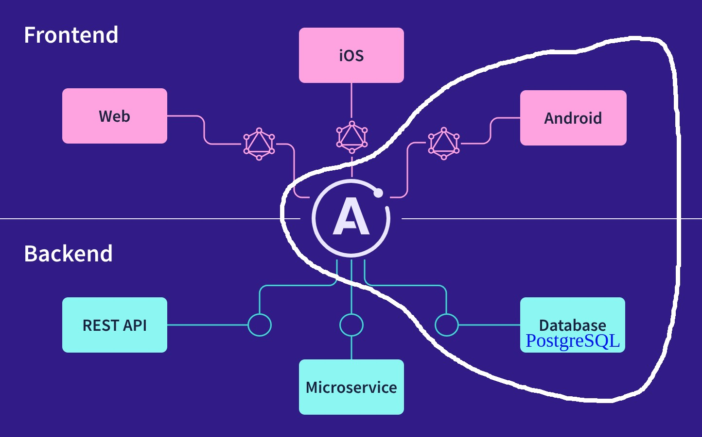

# Points Of Interest Service

The idea is to use GraphQL instead of REST since i am doing a single query with multiple data to chose the correct POIs. 

## Technologies used
- **Node JS and Apollo Server**: Simplifies the process of building GraphQL APIs. It is also well documented and seems easy to use.

- **PostgreSQL with PostGIS extension**: Widely used database. Can be seamlessly integrated with Apollo Server, allowing me to efficiently fetch and manipulate data for our GraphQL API. PostGIS will be used to add support for geographic objects.

    

## GraphQL Schema (SDL)

The query must have into consideration different inputs in order to retrieve the correct POI's and their respective information.
Searching parameters are mostly optional and can be:
  - location name -> city, region, country
  - category -> beach, nature, history, food, shopping, restaurant, museum
  - openingHours -> 12-16,19-22 (pm) 
  - schedule -> monday-friday
  - price range -> €€ - €€€ 

One can also search POI's by their exact location in the moment (using GPS to obtain latitude and longitude), choosing as input the length of the radius.
  - latitude -> -90 to 90 (Decimal Degrees)
  - longitude -> -180 to 180 (Decimal Degrees)
  - radius -> 100 to 5000 meters

If there are no input arguments, default POI's will be displayed.

The output will be a list of POI's with the following information (id, name, location, description and category are mandatory):
  - id
  - name
  - latitude
  - longitude
  - location name
  - description
  - openingHours
  - schedule
  - capacity
  - price range
  - thumbnail

The first schema structure looks like this:

```graphql
type PointOfInterest { 
    id: ID!
    name: String!
    latitude: Float
    longitude: Float
    locationName: String!
    description: String!
    openingHours: String
    schedule: String
    capacity: Int
    priceRange: String
    thumbnail: String
  }

  input PoiSearchInput {
    latitude: Float
    longitude: Float
    radius: Float
    locationName: String
    category: String
    openingHours: String
    schedule: String
    priceRange: String
  }

  type Query {
    searchPointsOfInterest(searchInput: PoiSearchInput): [PointOfInterest!]!
  }
  ```

Example of query:

```graphql
query {
  searchPointsOfInterest(
    searchInput: {
      locationName: "Algarve"
      category: "beach"
    }
  ) {
    id
    name
    latitude
    longitude
    locationName
    description
    openingHours
    schedule
    capacity
    priceRange
    thumbnail
  }
}
```

This query will return a JSON response with a list of beaches located in Algarve. Information like price range and capacity are optional, i.e. can be null, and will not be presented in this case (most beaches don't have neither price range or capacity).
For a better understanding of the query, the following image shows the structure of the expected response:
```json
{
  "data": {
    "searchPointsOfInterest": [
      {
        "id": "1",
        "name": "Praia da Marinha",
        "latitude": 37.08749965,
        "longitude": -8.406331708,
        "locationName": "Algarve, Portugal",
        "description": "Praia da Marinha is one of the most emblematic and beautiful beaches in the Algarve region. It features stunning cliffs, crystal-clear waters, and golden sand.",
        "category": "Beach",
        "openingHours": null,
        "schedule": null,
        "capacity": null,
        "priceRange": null,
        "thumbnail": "https://example.com/praia-da-marinha-thumbnail.jpg"
      },
      {
        "id": "2",
        "name": "Praia da Falésia",
        "latitude": 37.08611, 
        "longitude": -8.168000,
        "locationName": "Algarve, Portugal",
        "description": "Praia da Falésia is a breathtaking beach known for its towering cliffs and golden sands. It offers stunning views and is perfect for sunbathing and swimming.",
        "category": "Beach",
        "openingHours": null,
        "schedule": null,
        "capacity": null,
        "priceRange": null,
        "thumbnail": "https://example.com/praia-da-falesia-thumbnail.jpg"
      }
    ]
  }
}
```

Another example of query, using the nearby location search:

```graphql
query {
  searchPointsOfInterest(
    searchInput: {
      latitude: 40.2084
      longitude: -8.4236
      radius: 1000
    }
  ) {
    id
    name
    latitude
    longitude
    locationName
    description
    capacity
    priceRange
    thumbnail
  }
}
```

With this query we can obtain id, name, precise geographic coordinates, location name, description, capacity, price range and photo of a list of POIs located within a 1km radius of the user's current position.
Since in this case the user is located near the center of Coimbra, the result are the 2 POIs as shown below:

```json
{
  "data": {
    "searchPointsOfInterest": [
      {
        "id": "3",
        "name": "Jardim Botânico de Coimbra",
        "latitude": 40.205148,
        "longitude": -8.420713,
        "locationName": "Coimbra, Portugal",
        "description": "The Coimbra Botanical Garden is a beautiful botanical garden located in the heart of Coimbra. It features a diverse collection of plants and trees from around the world.",
        "category": "Nature",
        "openingHours": null,
        "schedule": null,
        "capacity": null,
        "priceRange": null,
        "thumbnail": "https://example.com/botanical-garden-thumbnail.jpg"
      },
      {
        "id": "4",
        "name": "Rio Mondego",
        "latitude": 40.205520,
        "longitude": -8.429349,
        "locationName": "Coimbra, Portugal",
        "description": "The Mondego River is the longest river entirely within Portuguese territory. It flows through Coimbra, offering picturesque views and recreational activities.",
        "category": "Nature",
        "openingHours": null,
        "schedule": null,
        "capacity": null,
        "priceRange": null,
        "thumbnail": "https://example.com/mondego-river-thumbnail.jpg"
      }
    ]
  }
}
```
