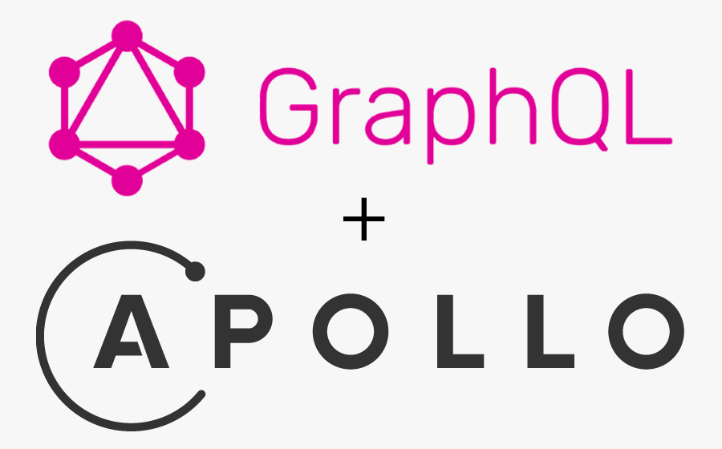

# Points Of Interest Service

The idea is to use GraphQL instead of REST since i am doing a single query with multiple data to chose the correct POIs. 

## Technologies used
- **Node JS and Apollo Server**: Simplifies the process of building GraphQL APIs. It is also well documented and seems easy to use.

<div style="display: flex; justify-content: center;">
  
</div>
<br></br>

- **MongoDB (with Geospatial data)**: Widely used non-relational database. Can be seamlessly integrated with Apollo Server, allowing me to efficiently fetch and manipulate data for our GraphQL API. Some information about Points of Interest (POIs) may be absent, and since MongoDB does not require space to store null values, this feature offers a distinct advantage in terms of data storage efficiency.
The usage of Geospatial queries using MongoDB is documented in https://www.mongodb.com/docs/manual/geospatial-queries/#geospatial-indexes.

    

## GraphQL Logic

### Search Points of Interest Query (Includes the defined Schema)

Firstly it is important to notice the query for searching POI's must have into consideration different inputs in order to retrieve the correct POI's and their respective information.
As this service is mainly focused on geospatial searches the searching parameters (all optional) are:
  - location -> Represented by longitude and latitude coordinates in a 2D Point format
  - radius -> Search radius within the specified location
  - location name -> City, Region, Country
  - category -> Nature, Food, Culture, Shopping or Landmark


Below is shown some of the validation done to the inputs of the query. Some validation is already done at the schema, for example, validation of the inputed data types.
  - location:
    - latitude -> -90 to 90 (Decimal Degrees)
    - longitude -> -180 to 180 (Decimal Degrees)
  - radius -> 100 to 5000 Meters
  - category -> Must be one of the five specified above

If there are no input arguments, default POI's will be displayed.

The output will be a list of POI's with the following information (id, name, location, description, category are mandatory):
  - id
  - name
  - location (coordinates)
  - location name
  - street
  - postcode
  - description
  - category
  - thumbnail

The schema structure (without the mutations) looks like this:

```graphql
type PointOfInterest { 
    _id: ID!
    name: String!
    location: Point!
    locationName: String!
    street: String
    postcode: String
    description: String
    category: String
    thumbnail: String
  }

  input PoiSearchInput {
    location: PointInput
    radius: Float
    locationName: String
    category: String
  }

  type Point {
    type: String!
    coordinates: [Float]!
  }

  input PointInput {
    type: String!
    coordinates: [Float]!
  }

  type Query {
    searchPointsOfInterest(searchInput: PoiSearchInput, apiKey: String!): [PointOfInterest!]!
    
    recoverApiKey(clientName: String!): String!
  }
  ```

#### Example of usage (Using location name and category):

```graphql
query findPOIs {
  searchPointsOfInterest(
    apiKey: "Tigas:6969889805d8b24004a7f7741fd69a1e"
    searchInput: {
      locationName: "Aveiro"
      category: "Food"
    }
  ) {
    _id
    name
    location {
      coordinates
    }
    locationName
    street
    postcode
    description
    category
    thumbnail
  }
}
```

With this query we can obtain id, name, precise geographic coordinates, location name, street, postcode, description, category, photo and the list of events associated with a list of POIs located in Aveiro that fit in the Food category. 
For a better understanding of the query, the following image shows the structure of the expected JSON response (in this case, only one POI was found):

```json
{
  "data": {
    "searchPointsOfInterest": [
      {
        "_id": "5",
        "name": "Restaurante Espeto do Sul",
        "location": {
          "coordinates": [
            -8.649476,
            40.635707
          ]
        },
        "locationName": "Aveiro, Portugal",
        "street": "R. de São Sebastião 97",
        "postcode": "3810-187",
        "description": "O sabor único do genuíno rodízio brasileiro conquista Aveiro, sendo o mais típico restaurante brasileiro onde cada refeição é uma festa!",
        "category": "Food",
        "thumbnail": "https://example.com/botanical-garden-thumbnail.jpg",
      }
    ]
  }
}
```

#### Example of usage (Using location coordinates for a nearby search):

```graphql
query findPOIs {
  searchPointsOfInterest(
    apiKey: "Tigas:6969889805d8b24004a7f7741fd69a1e"
    searchInput: {
      location: {
        type: "Point"
        coordinates: [-8.406331708, 37.08749965]
      }
      radius: 25000
    }
  ) {
    _id
    name
    location {
      coordinates
    }
    locationName
    street
    postcode
    description
    category
    thumbnail
  }
}
```

With this query we can obtain all the information associated with a list of POIs located within a 25km radius from the user's current position.
Since, in this example, the user is located somewhere in Algarve, the result are the 2 POIs shown below:

```json
{
  "data": {
    "searchPointsOfInterest": [
      {
        "_id": "1",
        "name": "Praia da Marinha",
        "location": {
          "coordinates": [
            -8.406331708,
            37.08749965
          ]
        },
        "locationName": "Algarve, Portugal",
        "street": null,
        "postcode": "8400-407",
        "description": "Praia da Marinha is one of the most emblematic and beautiful beaches in the Algarve region. It features stunning cliffs, crystal-clear waters, and golden sand.",
        "category": "Nature",
        "thumbnail": "https://example.com/praia-da-marinha-thumbnail.jpg"
      },
      {
        "_id": "2",
        "name": "Praia da Falésia",
        "location": {
          "coordinates": [
            -8.168,
            37.08611
          ]
        },
        "locationName": "Algarve, Portugal",
        "street": null,
        "postcode": null,
        "description": "Praia da Falésia is a breathtaking beach known for its towering cliffs and golden sands. It offers stunning views and is perfect for sunbathing and swimming.",
        "category": "Nature",
        "thumbnail": "https://example.com/praia-da-falesia-thumbnail.jpg"
      }
    ]
  }
}
```

### Mutations - Create, Update and Delete POIs
In GraphQL mutations are typically used for operations that cause changes to the data, while queries are used for read-only operations. 

For this reason, three mutations were created for simple operations within the POI collection stored in the database. These mutations include creation, modification and deletion of POIs. Their definitions in the schema are as follows:
```graphql
input CreatePointOfInterestInput {
    name: String!
    location: PointInput!
    locationName: String!
    street: String
    postcode: String
    description: String
    category: String
    thumbnail: String
  }

  input UpdatePointOfInterestInput {
    name: String
    location: PointInput
    locationName: String
    street: String
    postcode: String
    description: String
    category: String
    thumbnail: String
  }

  type Mutation {
    createPointOfInterest(input: CreatePointOfInterestInput!, apiKey: String!): PointOfInterest!
    updatePointOfInterest(id: ID!, input: UpdatePointOfInterestInput!, apiKey: String!): PointOfInterest!
    deletePointOfInterest(id: ID!, apiKey: String!): String!
  }
```
The creation of a new POI requires three mandatory input fields: name, location (coordinates), and location name.
Upon execution, both the Create and Update mutations return a JSON object containing the information of the newly created or modified POI. The Delete mutation returns a string, indicating either the successful deletion of the POI or an acknowledgment that the specified POI was not found.

#### Example of usage (Create)
```graphql
mutation exCreation {
  createPointOfInterest(
    apiKey: "Tigas:6969889805d8b24004a7f7741fd69a1e"
    input: {
    name: "New Point of Interest"
    location: { type: "Point", coordinates: [-8.606590, 40.132760] }
    locationName: "Some Location Name"
    description: "Some brief description",
    thumbnail: "https://example.com/praia-da-marinha-thumbnail.jpg"
  }) {
    _id
    name
    location {
      coordinates
    }
    locationName
    street
    postcode
    description
    category
    thumbnail
    }
  }
```
In this case, since no street, postcode or category values were provided, these fields will not be populated in the database for the respective document. Consequently, whenever this particular POI is queried, these pieces of information will be null. 

The result of the creation is the JSON shown below:
```json
{
  "data": {
    "createPointOfInterest": {
      "_id": "6600a5d099203c3b78465865",
      "name": "New Point of Interest",
      "location": {
        "coordinates": [
          -8.60659,
          40.13276
        ]
      },
      "locationName": "Some Location Name",
      "street": null,
      "postcode": null,
      "description": "Some brief description",
      "category": null,
      "thumbnail": "https://example.com/praia-da-marinha-thumbnail.jpg"
    }
  }
}
```

#### Example of usage (Update)
```graphQL
mutation exUpdate {
  updatePointOfInterest(
    apiKey: "Tiago:9f24cd24ab80e32b6582da3ae2187e9c"
    id: "9"  # Specify the ID of the point of interest to update
    input: {
      name: "Updated name"
    }
  ) {
    _id
    name
    location {
      coordinates
    }
    locationName
    street
    postcode
    description
    category
    thumbnail
  }
}
```
#### Example of usage (Delete)
```graphQL
mutation exDelete {
  deletePointOfInterest(
    apiKey: "Tiago:9f24cd24ab80e32b6582da3ae2187e9c"
    id: "9"  # Specify the ID of the point of interest to delete
    )  
}
```


### API Keys
As demonstrated in the examples above, authentication using an API Key is essential for client authorization when utilizing the search POIs query or the different mutations available. 

Acknowledging this necessity, a mutation titled 'generateApiKey' was created, which operated without the need of key authentication. This mutation expects the name of the client and a password as arguments and returns a new API Key specifically for that client. 
Furthermore, considering scenarios where clients might have previously generated a key but failed to store it correctly, the recoverApiKey query has been implemented to facilitate the retrieval of their key.

#### Examples of usage (Generate and Recover)
```graphQL
mutation createApiKey {
  generateApiKey(
    clientName: "Tigas"
    password: "1234"
  )
}

query recoverApiKey {
  recoverApiKey(
    clientName: "Tigas"
    password: "1234"
  )
}
```

After the key is generated, it just needs to be included in the inputs of the queries and mutations to enable full access to the API functionalities.